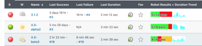
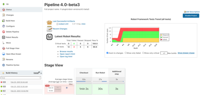

  

## Description

This plugin collects and publishes [Robot
Framework](http://robotframework.org/ "Robot Framework Home")
test results in Jenkins.  
Preconditions: all "suggested plugins" are "installed" in Jenkins.

[Issue
Tracker](https://issues.jenkins-ci.org/issues/?jql=project+%3D+JENKINS+AND+component+%3D+robot-plugin)

### Current features

-   Test suite and case details with trend graphs
-   Environment variable expansion for build paths in configuration
-   Wildcard support for output files for parsing and archiving of
    multiple Robot result files
-   Collection and archiving of original Robot report HTML files
-   Summary of Robot run on build page
-   Summary of latest Robot run on project page
-   Trend graph of passed tests over builds on project page
-   Marking build failed/unstable/successful according to pass
    thresholds given by user
-   Option of evaluating only critical tests against the pass thresholds
-   Listview column to show overall passed/failed tests in project
    listing and duration trend
-   Configurable archiving of arbitrary Robot related artifacts per
    build 
-   Token macros for usage with e.g. email-ext plugin
-   Test visibility in radiator views

### Configuration

#### Basic configuration of testing task

1.  Configure your project
2.  Select: Build -\> Add build step -\> execute shell/Execute Windows
    batch command
3.  Add the command to run the tests. You might have direct robot/jybot
    command here like `robot --variable name:value --outputdir
    my_robot_results my_test_suite` or in case you need to do
    something more, you can call any script that you use for running the
    tests. Relevant part from Robot Jenkins Plugin point of view is that
    this script generates the Robot outputs.
4.  Force your Robot script to return successfully from shell with `exit
    0` to empower the plugin in deciding if the build is success/failure
    (by default Robot exits with error code when there's any failed
    tests). You can do this for example by adding `--nostatusrc` to your
    test run (see
    [Robot Framework user guide](http://robotframework.org/robotframework/latest/RobotFrameworkUserGuide.html#return-codes)
    for details).
5.  Select: Post-build Actions -\> Publish Robot Framework test results
6.  Set path where your results are located (in above example command
    `my_robot_results`)
7.  If your output files are named differently than default (i.e.
    output.xml, report.html and log.html) specify the filenames by
    pressing the "Advanced..." button and writing the names in relevant
    fields. The fields support wildcards `*` and `?`.
8.  If you have other artifacts such as screenshots that you want to
    persist for viewing later in the logs you must configure them under
    "Advanced... -\> Other files to copy". The field accepts comma
    separated list of files and supports wildcards `*` and `?`.
9.  Set thresholds and optionally disable thresholds for critical tests
    only to count every test in the pass percentage.

#### Pipeline configuration

1. Run your tests in a similar way as you would normally by using the `sh` step.
2. Call the plugin with either the general `step` or directly by calling `robot` (only from
   version 2.0 onwards): `robot outputPath: '.', logFileName: 'log.html', outputFileName: 
   'output.xml', reportFileName: 'report.hml', passThreshold: 100, unstableThreshold: 75.0`

#### Configuring direct links to log files

##### Version 1.3.0

Links are automatically generated to whatever files are configured to
"Report html" and "Log html" in the plugin configuration. Links to log
and report HTMLs are now only in the summary sections in the middle of
the page and the sidebar link from previous versions have been removed.

##### Version 1.2.3 and earlier

From version 1.2 it's possible to configure a direct link from both
side panel and project/build page summaries to chosen file persisted with
the build. If no file is configured the link won't show up. Steps to do
this are as follows:

1.  Go to project configuration
2.  Configure the name of the file to be linked to Log/Report link field
3.  Make sure that you are saving the actual file you want to link with
    the build by checking the filenames/masks configured in the fields
    behind "Advanced..." button. By default these are output.xml,
    report.html and log.html which are the Robot Framework default names
4.  Save the configuration and run a build. The links are persisted per
    build in order to withstand changes in file naming. Thus the links
    won't appear in builds that exist already.
5.  Links should appear in the project/build summaries and in build
    side panel.

NOTE: After configuration change etc. the link will appear also in
project side panel, but for now it doesn't appear there right after the
build. Conversely, the project view side panel link won't go away until
after configuration change/resave in project. We're working on a
solution to this.

*side panel link*

  
*Summary link*

#### Configuring Robot overall pass/fail to show in the project list

1.  Go to Jenkins front page
2.  Select the + sign in the top tabs of the project listing to create a
    new view or go to
    [http://YOURJENKINSHOST/newView](http://yourjenkinshost/newView)
3.  Name your view and proceed creating a list view
4.  Choose project you want to include to the view. By default the
    "Robot pass/fail" column will appear to the column listing.
5.  Save view and select it from the top tabs in Jenkins project listing
6.  (Optional) If you want to have the view on by default go to "Manage
    Jenkins"-\>"Configure System" (or
    [http://YOURJENKINSHOST/configure](http://yourjenkinshost/configure)
    )and select your newly created view to be the default one.

*List view column in action*

#### Using token macros in e-mail report

Prerequisites: token-macro plugin and email-ext plugin installed.

1.  Go to project configuration
2.  Enable "Editable Email Notification" in post-build actions
    ([configuration
    reference](https://wiki.jenkins-ci.org/display/JENKINS/Email-ext+plugin))
3.  Now you can use the following Robot variables in your custom result
    email:

-   `${ROBOT_FAILEDCASES}` - Expands to list of failed Robot cases. Each
    case on its own line.
-   `${ROBOT_PASSPERCENTAGE, onlyCritical}` - Expands to pass percentage
    of tests. (passed / total \* 100 %),  
    onlyCritical - True if only critical tests should be calculated in
    percentage. Defaults to false.
-   `${ROBOT_PASSRATIO, onlyCritical}` Expands to build result in 'passed
    / total' format.  
    onlyCritical - True if only critical tests should be calculated in
    percentage. Defaults to false.
-   `${ROBOT_REPORTLINK}` - If logfile link is configured in the Robot
    plugin this link will point to that file for the build. Else show
    link to Robot reports directory for the build.

#### Displaying test numbers in build radiator views etc.

> :warning: If the Robot plugin marks the build as failure the tests will not show
up. This is because only unstable and successful builds are considered
to have test results per Jenkins.
>
>This means that in order to see the test results in other views you must
set your unstable threshold so that the build never goes to failure.

#### Log File Not Showing Properly

If you see an error saying that `Opening Robot Framework log failed`, the most probable reason
is that your Content Security Policy is too strict. Similarly, if your log opens, but it doesn't
show embedded images or similar, the reason is most probably in CSP settings.

See [here](https://www.jenkins.io/doc/book/system-administration/security/configuring-content-security-policy/)
and [here](https://content-security-policy.com/) how to change you CSP settings in your script console,
but be aware that **Changing CSP settings will potentially expose you Jenkins instance for
security vulnerabilities**.

### Robot Framework 4.x compatibility

The plugin supports both Robot Framework 3.x and 4.x output files. However, in order to support both, the plugin
shows some extra information for both. Test criticality was removed and "SKIP" status was added. So for 3.x the
results overview will show a `Skipped` column, which will always be 0 and for Robot Frameowork 4.x output files
the `Critical tests` row will always be 0.

Skipped tests aren't taken into account when calculating pass percentage, but they are calculated to the total
amount of tests.

Because criticality was removed in Robot Framework 4.0, having the `Use thresholds for critical tests only` checkbox
checked will always result in a passing step (because pass percentage is always considered to be 100% when there are
0 tests). In order to have set build status correctly, you **must** uncheck the checkbox or use `onlyCritical: false`
in your pipeline when you call `robot`.

### Overall Screenshots

##### Config

##### Project view

##### Build view

##### Detailed build view

## Bugs

[List of open bugs on
robot-plugin](https://issues.jenkins-ci.org/issues/?jql=component%20%3D%20robot-plugin%20AND%20resolution%20is%20EMPTY%20ORDER%20BY%20updated%20DESC)